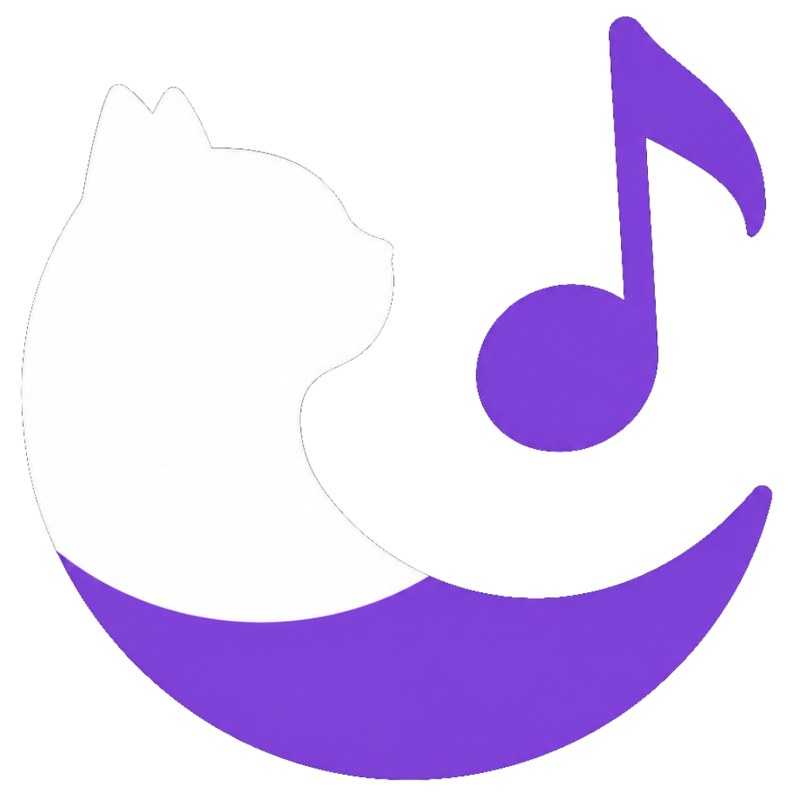

# NekoTune

A desktop YouTube Music wrapper based on [InnerTune](https://github.com/z-huang/InnerTune)/[OuterTune](https://github.com/InnerTune/OuterTune).

This is personal when I learn Rust and Typescript. AI used to code optimization..

That icon was taken from Internet, I unfortunately don't know who made it. Will probably replace it later.

> [!WARNING]  
> **Notes:** This project is still in early stages of development